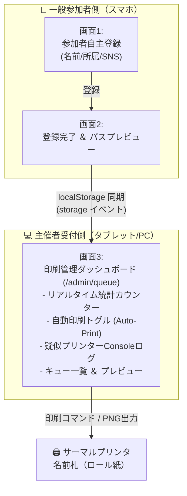

# qwen-otameshi-project (Event reception app)


**自主登録型イベント受付システム** — 参加者が自身のスマホでチェックイン登録（複数SNS対応）を行い、主催者用端末へリアルタイム同期して名前札を自動・手動印刷するハイブリッド受付システム。

---

## 📋 概要

本システムは、イベント受付での大混雑を回避するために設計された、**セルフチェックイン ＆ リアルタイム名前札印刷管理アプリ**です。

参加者は受付に掲示されたQRコード等から自身のスマホで登録ページにアクセスし、名前・所属・SNS情報を登録します。登録完了と同時に、データは主催者側の管理画面（プリンター接続中）にリアルタイムで転送され、サーマルプリンターから自動で名前札が印刷されます。参加者は受付テーブルに並んだ自身の名前札を受け取り、ホルダーに入れて入場します。

---

## 🏗️ システムアーキテクチャ



---

## 🚀 主な機能

### 1. 一般参加者向け機能
*   **スマホ自主登録画面 (`/`)**:
    *   お名前（必須）および所属（必須）の入力。
    *   最大5つのSNSアカウント（Instagram、X、GitHub、Discord、その他/ポートフォリオURL）を任意で連携・登録可能。
    *   X（Twitter）、GitHub、Discord については**Mock OAuth承認機能**を実装。連携ボタンを押すと承認用のポップアップ（モーダル）が表示され、数秒間のローディングとIDの自動生成（またはユーザーによる直接入力）で安全に連携。
*   **登録完了画面 (`/register-success?id={id}`)**:
    *   受付テーブルから名前札を受け取るための動線ガイド（ステップ指示付き）。
    *   生成された名前札のプレビュー表示。ライトテーマとダークテーマの切り替え表示、および高画質PNGのダウンロードに対応。

### 2. 主催者（受付管理）向け機能
*   **リアルタイム同期ダッシュボード (`/admin/queue`)**:
    *   **WebSocketレス同期**: スマホ登録画面（タブA）と管理画面（タブB）を同一PCのブラウザで左右に並べるだけで、`localStorage` の `storage` イベントを介してリロードなしで即座にデータが同期され、実機さながらのテストが可能。
    *   **統計サマリー**: 「総登録者数」「印刷待ち」「印刷完了」をカード形式でカウント。
    *   **自動印刷（Auto-Print）モード**: ONの場合、新しい登録データを受信した瞬間に自動でスプールから擬似印刷処理を実行し、ステータスを「印刷完了」に自動移行。
    *   **疑似プリンターConsoleログ**: システムスプーラーと接続されたサーマルプリンターの動作状況（USB接続確認、スプール数、ページ分割処理など）を、モノスペースフォントの緑文字ターミナル風にリアルタイムで出力。
    *   **プレビュー＆手動再印刷**: 登録者一覧の行をクリックすると、サイドバーにその参加者の名前札（分割分を含むすべて）のプレビューがその場で表示され、手動での再印刷（ダウンロード）も簡単に行えます。

---

## 🎨 名前札のレイアウト ＆ QRコード分割仕様 (`src/app/utils/passGenerator.ts`)

印刷用紙のサイズ制限やQRコードのスキャンのしやすさを考慮し、キャンバス描画時に以下の自動分割ロジックを搭載しています。

*   **SNSの登録がない場合**:
    *   QRコードは一切表示せず、お名前と所属を中央に大きく配置した「名前札のみ」を1枚出力します。
*   **SNSの登録が1〜2個の場合**:
    *   名前・所属・QRコード（最大2個まで横並び）を配置した名前札を1枚出力します。
*   **SNSの登録が3個以上の場合（分割出力）**:
    *   1枚の名前札に載せるQRコードは**最大2個**に制限し、3個目以降は別用紙（別の画像キャンバス）として自動的に2個ずつに分割出力します。
    *   例: 4つのSNSを登録した場合 → 「名前札1（2つのQRコード）」と「名前札2（残り2つのQRコード）」の合計2枚が印刷出力されます。
    *   複数枚に分割されたカードの右上には、受け取り時の混乱を防ぐために「CARD 1 / 2」「CARD 2 / 2」のような**ページ数インジケーター**を描画します。

---

## 🛠️ 技術スタック

*   **フレームワーク**: Next.js 16.2 (App Router)
*   **スタイリング**: Tailwind CSS v4 + Vanilla CSS (Gradients & Glassmorphism)
*   **QRコード生成**: `qrcode` (フロントエンド側で動的にCanvas DataURLを生成)
*   **リアルタイム同期**: HTML5 `storage` イベントリスナー（クライアント側での疑似リアルタイム同期）
*   **チェックアウト検証**: ESLint（厳格ルール: `react-hooks/set-state-in-effect`等に準拠）

---

## 📁 プロジェクトディレクトリ構成

```
qwen-otameshi-project/
├── docs/
│   └── issues/
│       ├── 01_qr_scanner_checkin.md       # 受付用QRスキャナーの仕様
│       ├── 02_pass_customization.md       # パスカードカスタマイズ・保存仕様
│       └── 03_multi_sns_profile.md        # 【最新】自主登録・分割印刷・管理画面仕様
├── src/
│   └── app/
│       ├── layout.tsx                     # ルートレイアウト
│       ├── page.tsx                       # 【参加者】自主登録フォーム画面
│       ├── globals.css                    # グローバルスタイル (Tailwind v4)
│       ├── register-success/
│       │   └── page.tsx                   # 【参加者】登録完了 ＆ パスプレビュー画面
│       ├── admin/
│       │   └── queue/
│       │       └── page.tsx               # 【主催者】リアルタイム印刷キューダッシュボード
│       ├── scan/
│       │   └── page.tsx                   # 【受付】旧来型QRコードスキャナー画面
│       ├── utils/
│       │   ├── types.ts                   # 共有データ構造定義
│       │   ├── storage.ts                 # localStorage リアルタイム同期管理
│       │   └── passGenerator.ts           # キャンバス描画 ＆ QRコード分割エンジン
│       ├── instagram/
│       │   └── page.tsx                   # (レガシー) 旧Instagram連携画面
│       └── twitter/
│           └── page.tsx                   # (レガシー) 旧Twitter連携画面
```

---

## ⚙️ 起動方法 ＆ テスト手順

### 1. インストール
```bash
npm install
```

### 2. 開発サーバーの起動
```bash
npm run dev
```
起動後、ブラウザで `http://localhost:3000` を開きます。

### 3. リアルタイム自動印刷の動作テスト
1.  ブラウザで次の2つのタブを左右に並べて表示します。
    *   **左画面:** `http://localhost:3000` (参加者登録画面)
    *   **右画面:** `http://localhost:3000/admin/queue` (主催者印刷キュー画面)
2.  右側の画面で、「自動印刷: OFF」をクリックして **「ON」** に切り替えます。
3.  左側の画面で、「お名前」「所属」を入力します。
4.  SNS連携で、好きなものを2個または3個以上登録（モック連携またはInstagram入力）します。
5.  「登録して受付完了」をクリックします。
6.  **結果:** 
    *   左画面が登録完了画面に切り替わり、分割出力された美しい名前札（CARD 1/2, CARD 2/2等）のプレビューが表示されます。
    *   右画面のキュー一覧に、**リロードなしで即座にデータが追加**され、Consoleログにスプールと印刷のアニメーションログがリアルタイムで流れ、自動的に「印刷完了」となることを確認できます。
